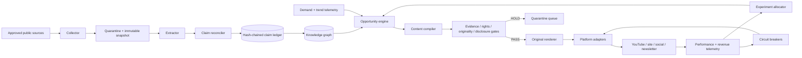
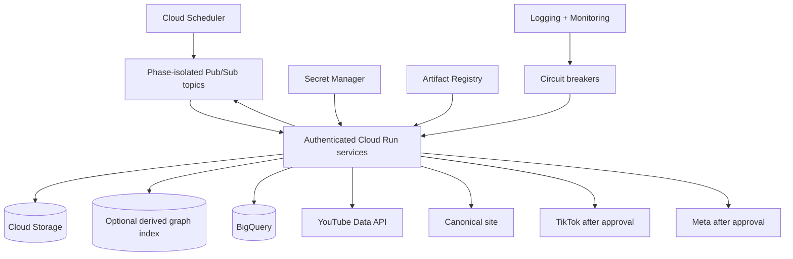

# System Architecture

## Logical pipeline

## Separation of authority

| Worker | Authority | Forbidden action |
|---|---|---|
| Scout | Fetch allowlisted sources and trend telemetry | Publish or infer facts |
| Verifier | Extract, reconcile, and classify claims | Create titles or media |
| Cartographer | Maintain entities, relationships, and timelines | Upgrade claim certainty |
| Planner | Rank opportunities and assign formats | Override policy gates |
| Compiler | Draft only from claim IDs | Introduce unsourced facts |
| Rights controller | Classify assets and license scope | Assume fair use or implied permission |
| Publisher | Upload passed packages with scoped tokens | Edit content or bypass a hold |
| Analyst | Read performance and propose experiments | Delete adverse results |
| Auditor | Verify hashes, lineage, and corrections | Modify records |

## Core records

### Source

Canonical locator; publisher; tier; publication/retrieval timestamps; immutable hash; rights posture; prohibited/leak flag; snapshot location.

### Claim

Immutable ID; normalized proposition; state; supporting and contradicting source IDs; confidence; entities; timestamps; public wording boundary; supersession relationships.

### Content package

Opportunity ID; claim IDs; platform; title/body/script; disclosures; asset manifest; originality telemetry; gate report; publication identity; experiment assignment.

## Reference Google Cloud deployment

Recommended topics:

- `source.discovered`
- `source.snapshotted`
- `claim.pending`
- `claim.changed`
- `opportunity.ready`
- `content.compiled`
- `content.held`
- `content.passed`
- `publish.requested`
- `publish.completed`
- `metrics.received`
- `correction.required`

## Idempotency and interrupted delivery

Every phase receives an immutable event ID. Child event IDs are derived deterministically from the parent event and next phase. In the Cloud Run deployment, a private, versioned Cloud Storage state bucket stores generation-matched event records with processing and dispatch leases. Each version 2 state record binds the event ID to a canonical request digest, so replaying an ID with different request material is a terminal rejection. Publish event IDs already bind the complete package and publication-authority material, so lineage-only duplicates resolve to the same external-side-effect identity. The authoritative event state does not depend on a separately provisioned database.

The state machine has four operative outcomes:

- `PROCESS`: this worker owns a bounded processing lease;
- `DISPATCH`: a committed result is ready to send to the next phase;
- `RETURN`: the event already completed and its canonical response is returned;
- `BUSY`: another unexpired lease owns the event, so Pub/Sub is told to retry.

A crash before result commit permits lease reclamation. A caught retryable failure safely releases its current token so it can be retried immediately. Permanent input or artifact-integrity failures commit a terminal rejection and are acknowledged, while transient storage unavailability remains retryable. A crash after result commit permits dispatch resumption. Pub/Sub transport remains at-least-once, so the deterministic child event ID is also resolved by the downstream phase. Live platform adapters require an additional platform-publication identity check before external side effects are enabled. Publish verifies its event ID against current package and authority material before work begins. Once enabled publication may have started, an ambiguous failure retains a one-hour lease before marker-based reconciliation instead of immediately repeating the side effect. Version 0.8.0 deliberately rejects legacy state records that lack a request digest. The production event-state prefix must be empty or explicitly drained before this version is activated.

For network collection, version 0.8.0 retains the durable `collect` to `reconcile` data boundary introduced in v0.7.3. Collect writes content-addressed snapshot files create-only to the source-quarantine bucket and commits a canonical manifest last. The manifest binds the exact source-registry digest, one sorted summary per authorized source, and the matching metadata and body files. Reconcile accepts only the configured bucket, exact manifest generation, exact manifest and file hashes, bounded safe paths, the same source-registry revision, and the expected root and parent event lineage. Request-scoped temporary trees are removed after commit or verification, including partial materializations. A reclaimed collect lease reuses an already committed manifest instead of fetching the network again. Verified live snapshots stop at `HOLD` until claim extraction is implemented, so they cannot silently fall through to baked seed claims. Later phase artifacts remain future work.

The create-only IAM and generation preconditions protect artifacts against the collect and reconcile workloads. Bucket administrators remain outside this immutability boundary and can exercise privileged control-plane authority. A separately governed, retention-locked evidence store is required before these snapshots are treated as admin-resistant audit records.

## Scaling posture

The first 82 days do not require Kubernetes. Authenticated Cloud Run services plus phase-isolated Pub/Sub delivery are sufficient until measured event latency or throughput proves otherwise.
